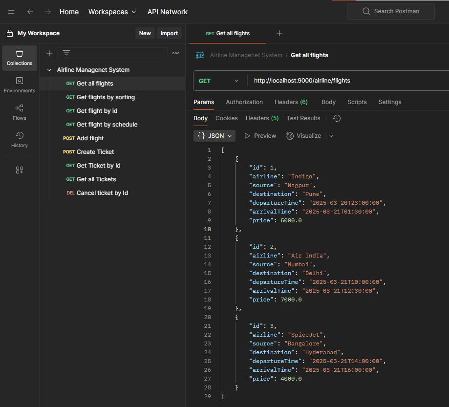
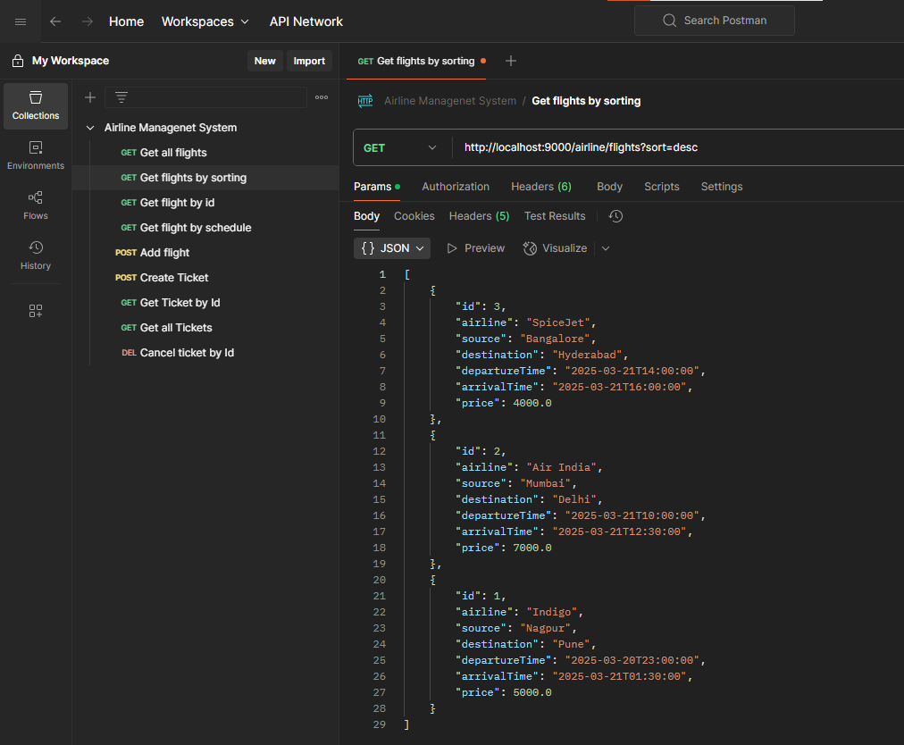
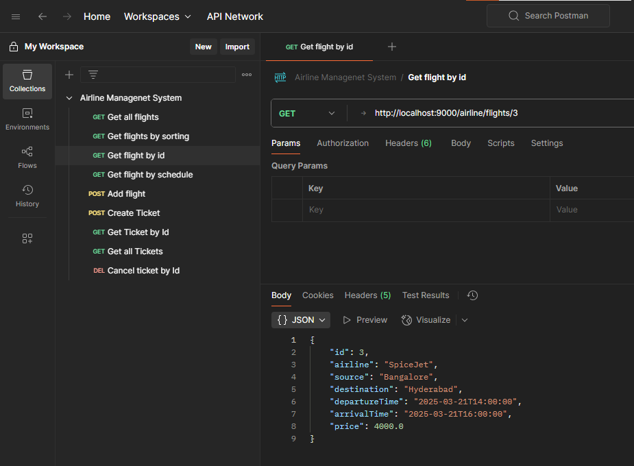
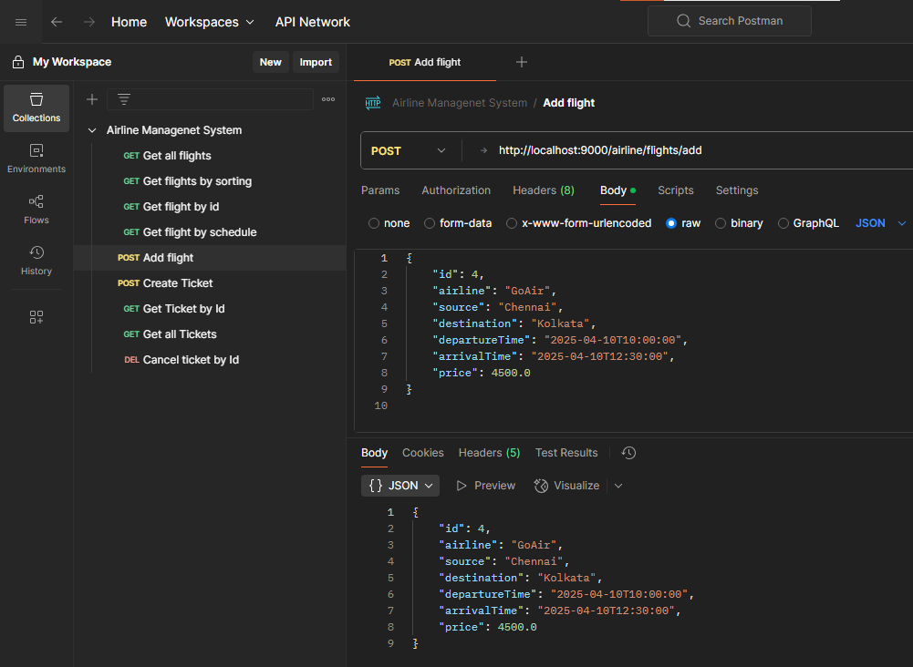
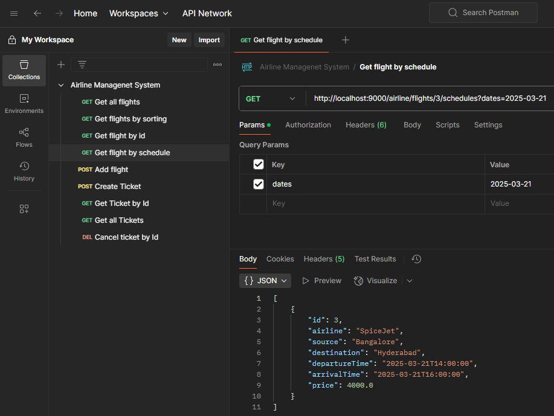
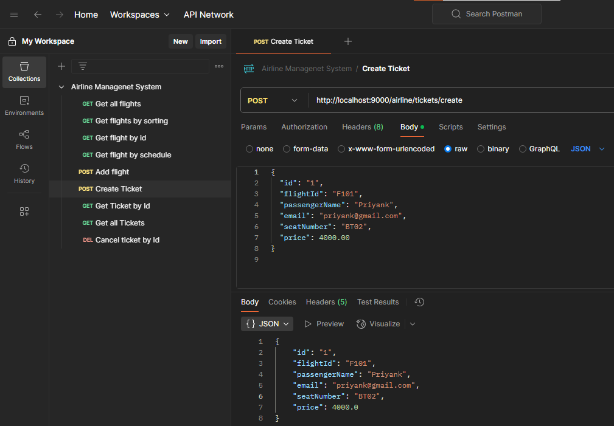
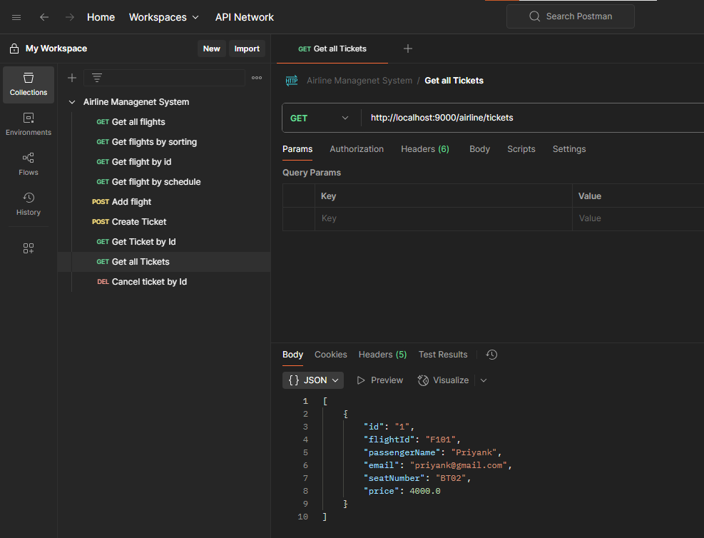
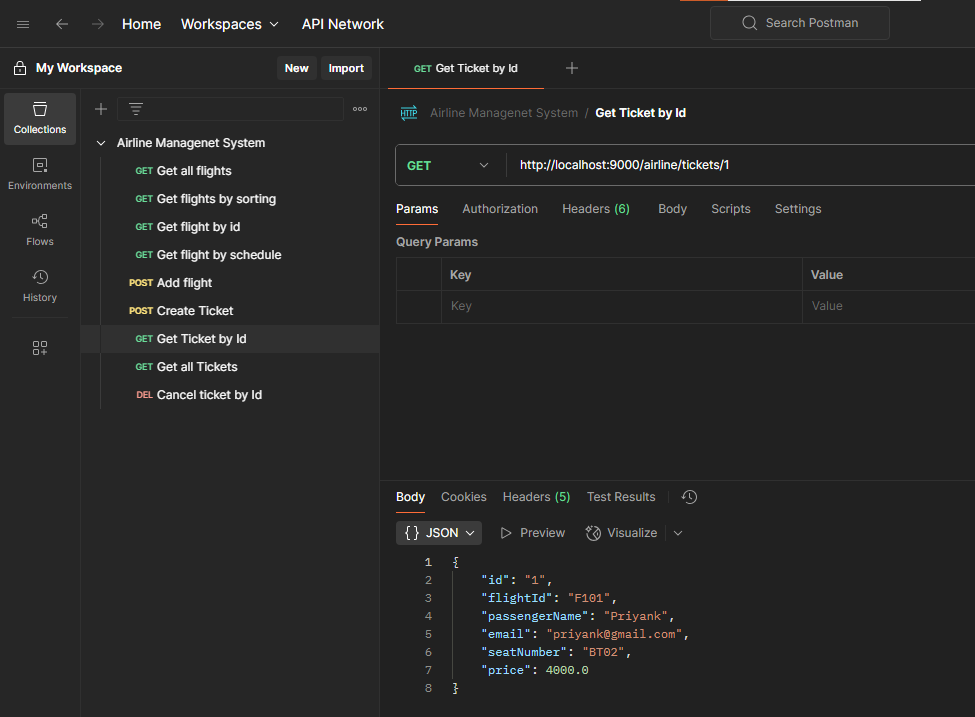
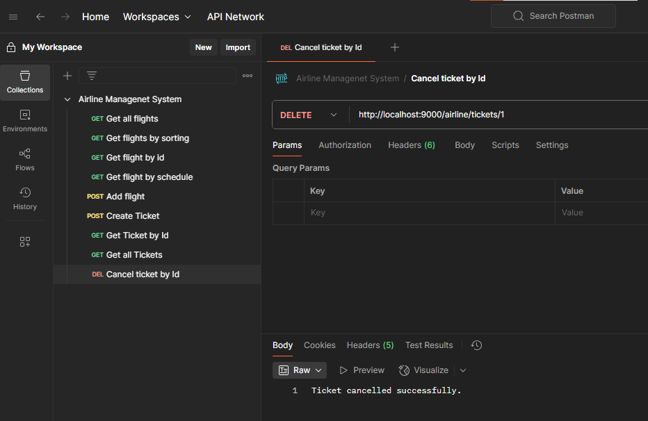

# ✈️ Airline Management System - Spring Boot

The **Airline Management System** is a RESTful API built using **Spring Boot** that allows users to **manage flight schedules and tickets**. It provides functionalities such as **booking tickets, retrieving flight schedules, and ticket cancellations** while ensuring proper data validation and error handling.

---

## 🚀 Features
✅ Retrieve flight schedules  
✅ Get ticket details  
✅ Book/Create tickets  
✅ Cancel tickets  
✅ Sorting flights (`GET /flights?sort=asc`)  
✅ Validations for duplicate entries and required fields    

---

## 🚀 Tech Stack  
- **Spring Boot** (REST APIs)  
- **Java 21**  
- **Maven** (Dependency Management)  
- **Spring Web** (For creating RESTful endpoints)  
- **Lombok** (To reduce boilerplate code)  
- **Postman** (For API testing)  

---

## 🔧 Setup Instructions  
1. Clone the repository:  
   ```sh
   git clone https://github.com/Priyank2310/Airline-Management-System.git
   cd Airline-Management-System
   ```
2. Build and run the project using Maven:  
   ```sh
   mvn clean install
   ```
3. The application will start on `http://localhost:9000/airline`  

---

## 📌 API Endpoints  

### 1️⃣ **Flight APIs**  
| Method  | Endpoint                                      | Description                        |
|---------|----------------------------------------------|------------------------------------|
| `GET`   | `/flights`                                   | Get all flights                    |
| `GET`   | `/flights?sort=asc|desc`                     | Get flights by sorting             |
| `GET`   | `/flights/{id}`                              | Get flight by ID                   |
| `GET`   | `/flights/{id}/schedules?dates=startDate`    | Get flight by schedule             |
| `POST`  | `/flights`                                   | Add flight                         |

### 2️⃣ **Ticket APIs**  
| Method  | Endpoint               | Description           |
|---------|------------------------|-----------------------|
| `POST`  | `/tickets`             | Create Ticket        |
| `GET`   | `/tickets/{id}`        | Get Ticket by ID     |
| `GET`   | `/tickets`             | Get all Tickets      |
| `DELETE`| `/tickets/{id}`        | Cancel Ticket by ID  |

---

## 📝 Validations & Error Handling
- **Passenger Name:** Only alphabets allowed (`A-Z a-z`)  
- **Email:** Must be a valid email format  
- **Seat Number:** Format must be `A1, B12`  
- **Price:** Must be a positive number  
- **Duplicate Ticket ID:** Prevents duplicate ticket creation 

---

## 🎯 Usage (Testing with Postman)

### 1️⃣ **Get Flight Details**  
- **Endpoints:**  
  - `GET /flights`  
  - `GET /flights/{id}`  
  - `GET /flights?sort=asc|desc`  
- **Description:** Fetches all available flights sorted by departure time.  
- **Example Requests:**  
  ```http
  GET http://localhost:9000/airline/flights
  ```
   ```http
  GET http://localhost:9000/airline/flights?sort=desc
  ```
  ```http
  GET http://localhost:9000/airline/flights/{id}
  ```

- **Example Response:**  
  ```json
  [
    {
        "id": 1,
        "airline": "Indigo",
        "source": "Nagpur",
        "destination": "Pune",
        "departureTime": "2025-03-20T23:00:00",
        "arrivalTime": "2025-03-21T01:30:00",
        "price": 5000.0
    }
  ]
  ```
- **Screenshots:**  
    
    
      
    

---

### 2️⃣ **Get Flight Schedules by Date**  
- **Endpoint:** `GET /flights/{id}/schedules?dates=startDate`  
- **Example Request:**  
  ```http
  GET http://localhost:9000/airline/flights/3/schedules?dates=2025-03-21
  ```
- **Screenshot:**  
    

---

### 3️⃣ **Create a Ticket (Book Flight)**  
- **Endpoint:** `POST /tickets`  
- **Example Request:**  
  ```http
  POST http://localhost:9000/airline/tickets/create
  ```
  ```json
  {
    "id": "1",
    "flightId": "F101",
    "passengerName": "Priyank",
    "email": "priyank@gmail.com",
    "seatNumber": "BT02",
    "price": 4000.0
  }
  ```
- **Screenshot:**  
    

---

### 4️⃣ **Get All Ticket Details**  
- **Endpoint:** `GET /tickets`  
- **Example Request:**  
  ```http
  GET http://localhost:9000/airline/tickets/1
  ```
- **Screenshot:**  
    

---

### 5️⃣ **Get Ticket Details By Id**  
- **Endpoint:** `GET /tickets/{id}`  
- **Example Request:**  
  ```http
  GET http://localhost:9000/airline/tickets/1
  ```
- **Screenshot:**  
    

---

### 6️⃣ **Cancel Ticket**  
- **Endpoint:** `DELETE /tickets/{id}`  
- **Example Request:**  
  ```http
  DELETE http://localhost:9000/airline/tickets/1
  ```
- **Screenshot:**  
    

---
